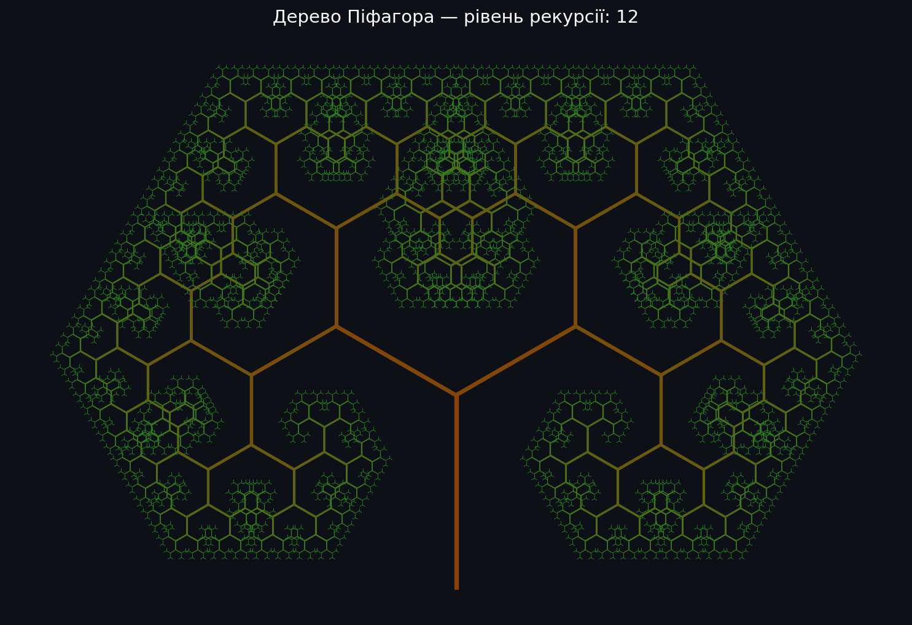
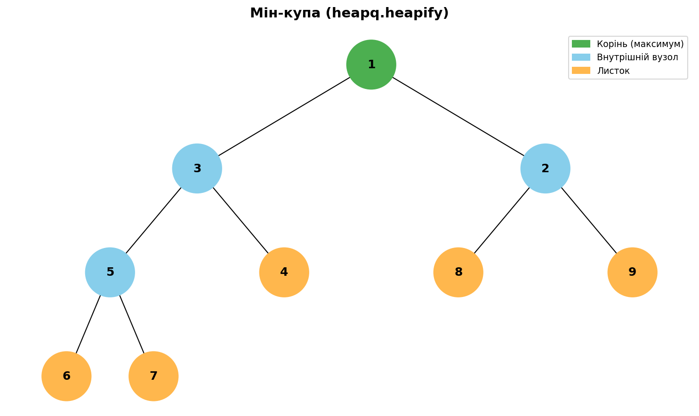
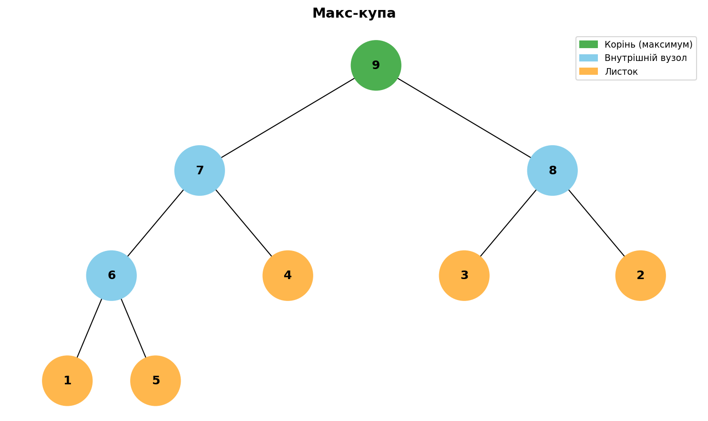
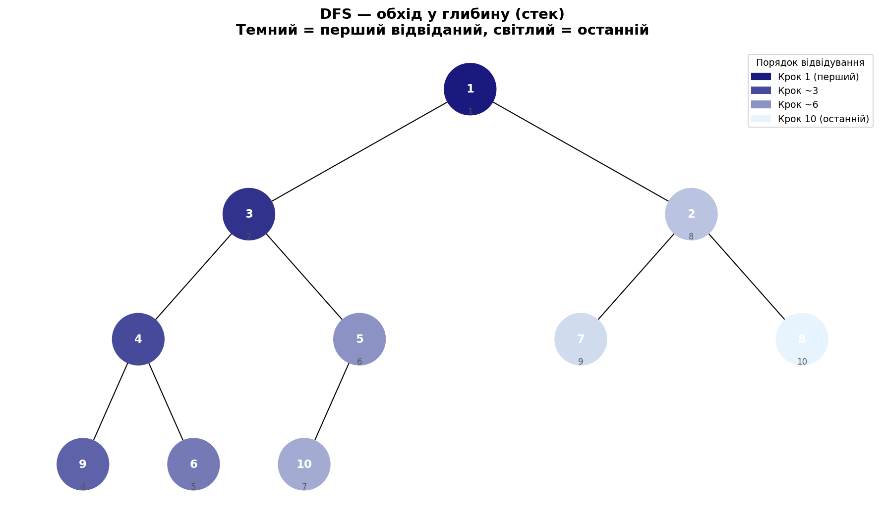
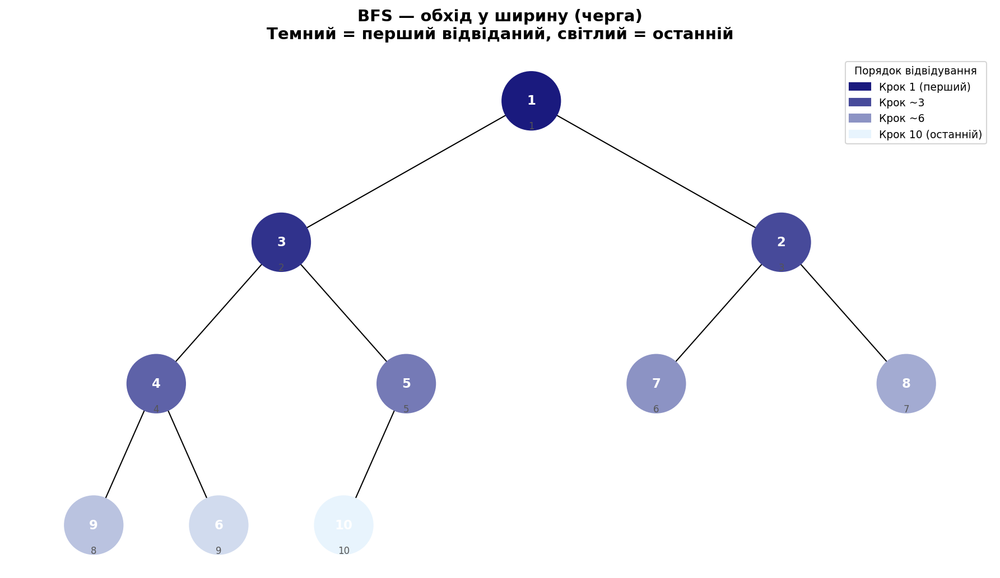
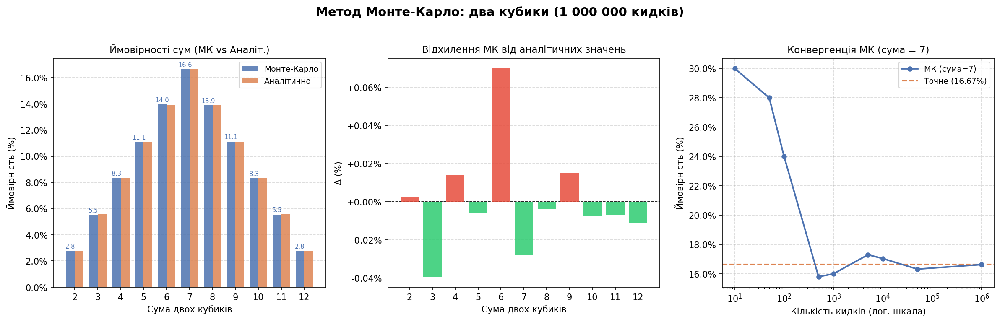

# Final Project
## Структура проєкту

```
goit-algo-fp/
├── task1.py           # Завдання 1. Структури даних. Сортування. Робота з однозв'язним списком
├── task2.py           # Завдання 2. Дерево Піфагора (рекурсивний фрактал)
├── task3.py           # Завдання 3. Дерева, алгоритм Дейкстри
├── task4.py           # Завдання 4. Візуалізація піраміди
├── task5.py           # Завдання 5. Візуалізація обходу бінарного дерева
├── task6.py           # Завдання 6. Жадібні алгоритми та динамічне програмування
├── task7.py           # Завдання 7. Використання методу Монте-Карло
│
├── task2_pythagorean_tree.png
├── task4_min_heap.png
├── task4_max_heap.png
├── task4_original_tree.png
├── task5_dfs.png
├── task5_bfs.png
├── task7_monte_carlo.png
│
├── requirements.txt
├── .gitignore
└── README.md
```

## Підготовка до запуску, Залежності

```bash
python -m venv .venv 
source .venv/bin/activate
pip install -r requirements.txt
```

## Запуск задач
```bash
python task1.py
python task2.py --level 8 --angle 45 
python task3.py
python task4.py
python task5.py
python task6.py
python task7.py 
```

## Завдання 1 — Однозв'язний список

**Файл:** `task1.py`

Реалізація трьох операцій над однозв'язним списком:

| Функція | Алгоритм | Складність |
|---|---|---|
| `reverse_list` | Перебір із перекиданням вказівників `next` | O(n) час, O(1) пам'ять |
| `sort_list` | Сортування вставками з вузлом-сторожем | O(n²) час, O(1) пам'ять |
| `merge_sorted_lists` | Злиття двох відсортованих списків двома вказівниками | O(n+m) час, O(1) пам'ять |

**Типи:**
- `ListNode[T]` — вузол списку (generic)
- `LinkedList[T]` — обгортка зі вказівником на голову
- `Comparator[T]` — `Callable[[T, T], int]`, використовується у `sort_list` і `merge_sorted_lists`

**Ключова ідея `reverse_list`:**
```
prev ← None
current ← head
поки current не None:
    next_node ← current.next   # зберігаємо наступний
    current.next ← prev        # перекидаємо вказівник
    prev ← current             # рухаємось вперед
    current ← next_node
head ← prev                    # новий початок — колишній хвіст
```

---

## Завдання 2 — Фрактал «Дерево Піфагора»

**Файл:** `task2.py`

Рекурсивна побудова фракталу за допомогою `matplotlib`. Кожна гілка — відрізок; на її вершині рекурсивно виростають дві дочірні гілки, повернуті на кут `±angle` і скорочені на коефіцієнт `scale`.

**Базовий випадок:** `depth < 0` — рекурсія зупиняється.

**Схема рекурсії:**
```
_build_branch(start, length, angle, depth)
    ├── малює відрізок start → end
    ├── _build_branch(end, length × scale, angle + Δ, depth − 1)  ← ліва гілка
    └── _build_branch(end, length × scale, angle − Δ, depth − 1)  ← права гілка
```

**Типи:**
- `Point` (NamedTuple) — незмінна 2D-точка
- `Segment` (dataclass) — відрізок + глибина для кольорування
- `FractalConfig` (dataclass) — параметри: глибина, кут, коефіцієнт скорочення
- `FractalTree` (dataclass) — конфіг + список усіх відрізків

**Запуск з параметрами:**
```bash
python task2.py --level 10 --angle 45 --scale 0.71
```

**Результат:**



---

## Завдання 3 — Алгоритм Дейкстри

**Файл:** `task3.py`

Пошук найкоротших шляхів у зваженому графі від початкової вершини до всіх інших. Для вибору вершини з мінімальною відстанню використовується **бінарна мін-купа** (`heapq`).

**Складність:** O((V + E) · log V)

**Кроки алгоритму:**
```
1. dist[source] = 0,  dist[решта] = ∞
2. heap = [(0.0, source)]
3. Поки heap не порожній:
   а. (d, u) = heappop(heap)          ← O(log V)
   б. якщо u вже visited → пропустити
   в. для кожного ребра u → v:
      якщо d + вага < dist[v]:
          dist[v] = нова відстань
          prev[v] = u
          heappush(heap, (dist[v], v)) ← O(log V)
```

**Типи:**
- `Node = str` — вершина графа
- `Edge` (frozen dataclass) — ребро: `to: Node`, `weight: float`
- `Graph` (dataclass) — список суміжності `dict[Node, list[Edge]]`
- `DijkstraResult` (dataclass) — словники `dist` і `prev`, метод `path_to(target)`

**Демонстрація** — граф із 7 міст України. Приклад результату від Києва:

```
Київ → Харків:  Київ → Полтава → Харків  (16.0 км)
Київ → Дніпро:  Київ → Рівне → Вінниця → Дніпро  (15.0 км)
```

---

## Завдання 4 — Візуалізація бінарної купи

**Файл:** `task4.py`

На основі наданого коду (`Node`, `add_edges`, `draw_tree`) реалізовано функцію `heap_to_tree`, яка перетворює масив-купу на дерево вузлів.

**Ключова властивість бінарної купи у масиві:**
```
Вузол з індексом i:
    лівий нащадок  → 2·i + 1
    правий нащадок → 2·i + 2
```

**Нові функції:**
- `heap_to_tree(heap, index)` — рекурсивно будує дерево `Node` з масиву
- `visualize_heap(heap, title)` — точка входу: `heap_to_tree` + `draw_tree`

**Кольорова схема:**
- 🟢 Зелений — корінь (мінімальний/максимальний елемент)
- 🔵 Блакитний — внутрішній вузол
- 🟠 Жовтогарячий — листок

**Результати:**

| Мін-купа | Макс-купа |
|:---:|:---:|
|  |  |

---

## Завдання 5 — Візуалізація обходу бінарного дерева

**Файли:** `task5.py` (імпортує `Node`, `heap_to_tree`, `add_edges` з `task4.py`)

Візуалізація двох обходів дерева. Кожен відвіданий вузол отримує унікальний колір: градієнт від темно-синього (`#1A1A7E`) до світло-блакитного (`#E8F4FD`).

> ⚠️ Рекурсія не використовується — тільки стек і черга (`collections.deque`)

**DFS — обхід у глибину (стек, LIFO):**
```
stack: [корінь]
  pop → відвідуємо вузол
  push правого, потім лівого  ← щоб лівий опинився на вершині
```

**BFS — обхід у ширину (черга, FIFO):**
```
queue: [корінь]
  popleft → відвідуємо вузол
  append лівого, потім правого  ← рівень за рівнем
```

**Функція градієнту** `make_color_gradient(n)` лінійно інтерполює RGB між двома кольорами:
```python
t = step / (n - 1)          # 0.0 → 1.0
r = start_r + (end_r - start_r) * t
```

**Результати:**

| DFS (стек) | BFS (черга) |
|:---:|:---:|
|  |  |

---

## Завдання 6 — Жадібні алгоритми та динамічне програмування

**Файл:** `task6.py`

Задача про вибір страв з максимальною калорійністю в межах бюджету. Реалізовано два підходи:

### `greedy_algorithm` — Жадібний алгоритм
Сортує страви за спаданням питомої калорійності (`ккал / ₴`) і жадібно вибирає кожну, що вміщується у залишок бюджету.

- Складність: **O(n log n)**
- Не гарантує точного оптимуму

### `dynamic_programming` — Задача про рюкзак 0/1
Будує таблицю `dp[i][w]` = максимальна калорійність з перших `i` страв при бюджеті `w`.

```
dp[i][w] = max(
    dp[i−1][w],                            # не беремо страву i
    dp[i−1][w − cost[i]] + calories[i]     # беремо страву i
)
```

- Складність: **O(n × budget)**
- Гарантує точний глобальний оптимум

**Порівняння результатів при бюджеті 100 ₴:**

| | Жадібний | ДП |
|---|---|---|
| Обрані страви | cola, potato, pepsi, hot-dog | pizza, pepsi, cola, potato |
| Витрачено | 80 ₴ | 100 ₴ |
| Калорійність | **870 ккал** | **970 ккал** ✅ |

Жадібний алгоритм залишив 20 ₴ невикористаними, натомість ДП знайшов комбінацію, що використовує весь бюджет оптимально.

---

## Завдання 7 — Метод Монте-Карло

**Файл:** `task7.py`

Симуляція кидків двох кубиків. При N → ∞ відносна частота прямує до теоретичної ймовірності (закон великих чисел).

**Алгоритм:**
```
для кожного кидка (1..N):
    d1 = random.randint(1, 6)
    d2 = random.randint(1, 6)
    frequencies[d1 + d2] += 1

ймовірність[s] = frequencies[s] / N
```

**Результати при 1 000 000 кидків:**

| Сума | МК | Точна | Відхилення |
|:---:|:---:|:---:|:---:|
| 2 | 2.81% | 2.78% (1/36) | +0.029% |
| 7 | 16.63% | 16.67% (1/6) | −0.037% |
| 12 | 2.77% | 2.78% (1/36) | −0.005% |

Максимальне відхилення: **±0.043%** — підтверджує збіжність методу.

**Три панелі на графіку:**
1. **МК vs Аналітично** — стовпчаста діаграма порівняння
2. **Відхилення** — знак і величина похибки для кожної суми
3. **Конвергенція** — як ймовірність суми 7 наближається до 16.67% зі зростанням кількості кидків



---
