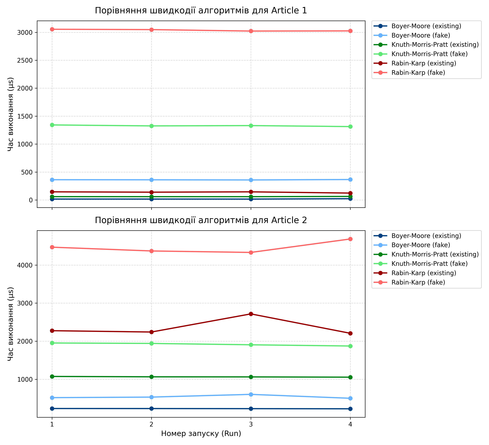

# Аналіз ефективності алгоритмів пошуку підрядків

Цей документ містить детальний огляд, порівняльні таблиці та графіки результатів тестування трьох класичних алгоритмів пошуку підрядків: **Boyer-Moore (Боєра-Мура)**, **Knuth-Morris-Pratt (Кнута-Морріса-Пратта)** та **Rabin-Karp (Рабіна-Карпа)**. Дослідження базується на даних чотирьох послідовних запусків (бенчмарків) для двох статей різної довжини.

---
## Інструкція із запуску та аналізу

Процес дослідження складається з двох етапів: збору статистичних даних (генерація звітів) та їх зведеної візуалізації (побудова графіків).

### Етап 1. Збір статистичних даних (Обов'язково)
Для отримання об'єктивних результатів тестування алгоритмів пошуку підрядків необхідно виконати кілька запусків основного скрипта:

1. **Перший запуск:** Виконайте команду:
   
	```bash
   	python substring_search_comparison.py
 
У результаті в папці проєкту з'явиться файл result.txt. Перейменуйте його на result1.txt.
2. **Наступні запуски:** Повторіть команду ще тричі. Кожен новий файл результату перейменовуйте за аналогією: result2.txt, result3.txt, result4.txt.

### Етап 2. Візуалізація результатів та побудова графіків (Опціонально)
Якщо ви бажаєте звести отримані текстові звіти у наочні таблиці та автоматично побудувати інтерактивні графіки, скористайтеся допоміжним скриптом:
1. Переконайтеся, що всі згенеровані файли (result1.txt — result4.txt) знаходяться в одній директорії зі скриптом.

2. Запустіть аналізатор:

	python scraping-results.py

Примітка: Скрипт scraping-results.py не є обов'язковим для базового тестування. Проте він полегшує аналіз, автоматично створюючи фінальне зображення з графіками швидкодії алгоритмів. Якщо згенерувано іншу кількість файлів, потрібно відредагувати список file_names на початку коду цього скрипта.

## Результати вимірювань (у мікросекундах, µs)

Нижче наведено зведені таблиці середнього часу виконання алгоритмів для кожного випадку.

### Стаття 1 (Довжина: 12 658 символів)
| Алгоритм | Тип патерна | Запуск 1 (µs) | Запуск 2 (µs) | Запуск 3 (µs) | Запуск 4 (µs) | Середнє значення (µs) |
| :--- | :--- | :---: | :---: | :---: | :---: | :---: |
| **Boyer-Moore** | Existing (існуючий) | 16.68 | 16.58 | 16.26 | 23.09 | **18.15** |
| | Fake (вигаданий) | 362.20 | 361.00 | 358.44 | 365.59 | **361.81** |
| **Knuth-Morris-Pratt** | Existing (існуючий) | 59.72 | 59.25 | 59.17 | 63.64 | **60.45** |
| | Fake (вигаданий) | 1342.36 | 1325.14 | 1330.73 | 1313.11 | **1327.84** |
| **Rabin-Karp** | Existing (існуючий) | 145.85 | 139.56 | 145.71 | 123.46 | **138.65** |
| | Fake (вигаданий) | 3053.82 | 3047.74 | 3021.71 | 3024.68 | **3036.99** |

### Стаття 2 (Довжина: 17 590 символів)
| Алгоритм | Тип патерна | Запуск 1 (µs) | Запуск 2 (µs) | Запуск 3 (µs) | Запуск 4 (µs) | Середнє значення (µs) |
| :--- | :--- | :---: | :---: | :---: | :---: | :---: |
| **Boyer-Moore** | Existing (існуючий) | 232.50 | 231.40 | 228.62 | 225.01 | **229.38** |
| | Fake (вигаданий) | 517.82 | 532.24 | 603.77 | 501.27 | **538.77** |
| **Knuth-Morris-Pratt** | Existing (існуючий) | 1074.32 | 1064.61 | 1062.39 | 1055.44 | **1064.19** |
| | Fake (вигаданий) | 1952.79 | 1941.09 | 1905.51 | 1873.43 | **1918.20** |
| **Rabin-Karp** | Existing (існуючий) | 2275.50 | 2240.77 | 2716.49 | 2207.79 | **2360.14** |
| | Fake (вигаданий) | 4468.03 | 4368.93 | 4330.41 | 4683.25 | **4462.65** |

---

##  Візуалізація продуктивності

На графіку нижче чітко видно залежність часу виконання від номера запуску. Для кожного алгоритму використано унікальний колір, а типи патернів відрізняються за інтенсивністю: насичений тон — для існуючих підрядків (`existing`), світліший — для вигаданих підрядків (`fake`).



---

## Аналіз та відмінності в роботі алгоритмів

### 1. Boyer-Moore (Боєра-Мура)
* **Принцип роботи:** Пошук здійснюється справа наліво (з кінця патерна). Використовує дві евристики: *евристику поганого символу* та *евристику хорошого суфікса*. Це дозволяє алгоритму безпечно пропускати значні блоки тексту без посимвольного порівняння.
* **Особливості бенчмарку:** Виявився **абсолютним лідером** у всіх тестах. Наприклад, для існуючого патерна в Статті 1 він працює в ~3.3 рази швидше за KMP і в ~7.6 разів швидше за Рабіна-Карпа.
* **Найкраще підходить для:** Реального пошуку у великих текстових файлах природних мов (книги, статті), де алфавіт відносно великий, а патерни довші за кілька символів. Завдяки стрибкам його середня складність становить $O(n/m)$, що робить його сублінійним на практиці.

### 2. Knuth-Morris-Pratt (Кнута-Морріса-Пратта)
* **Принцип роботи:** Шукає зліва направо, використовуючи заздалегідь обчислену *префікс-функцію* (pi-таблицю). Коли стається невідповідність, алгоритм знає, на скільки символів можна зсунути патерн без повернення назад по тексту.
* **Особливості бенчмарку:** Показав стабільний **другий результат**. Його час виконання лінійно залежить від довжини тексту і майже не зазнає випадкових коливань.
* **Найкраще підходить для:** Роботи з малими алфавітами (наприклад, бінарні дані, послідовності ДНК) або там, де патерни містять багато повторюваних елементів (наприклад, `"AAAAAB"`). Його головна перевага — залізна гарантія найгіршого випадку $O(n + m)$.

### 3. Rabin-Karp (Рабіна-Карпа)
* **Принцип роботи:** Використовує механізм хешування підрядків вікном, що ковзає (rolling hash). Хеш поточного вікна тексту порівнюється з хешем шуканого патерна. Посимвольна перевірка запускається лише тоді, коли хеші збігаються (колізія або потенційне входження).
* **Особливості бенчмарку:** Посів **третє місце**, виявившись найповільнішим. Його результати для вигаданих патернів (`fake`) сягають понад 4400 µs на Статті 2, оскільки алгоритм змушений обчислювати хеш для кожної позиції вікна та виконувати операції ділення за модулем великого числа.
* **Найкраще підходить для:** Сценаріїв **множинного пошуку** (коли в одному тексті потрібно знайти сотні різних патернів одночасно, наприклад, у системах перевірки на плагіат або антивірусних сканерах сигнатур). Також ефективний у випадках, коли хешування допомагає відсіяти 99% тексту до посимвольного порівняння.

---

## Висновок: Який алгоритм найкращий?

На основі отриманих експериментальних даних, **найкращим алгоритмом для загального пошуку підрядків є Boyer-Moore**. 
Він продемонстрував мінімальний час виконання як для випадків, коли слово гарантовано є в тексті, так і для відсутніх слів (`fake`). Його ефективність зростає разом із масштабом тексту. Втім, вибір алгоритму завжди залежить від контексту завдань:
1. **Boyer-Moore** — для стандартних текстових редакторів та роботи з природними мовами.
2. **KMP** — для критично важливих систем із жорстким обмеженням часу (де недопустиме уповільнення в найгіршому випадку) та генетичних алгоритмів.
3. **Rabin-Karp** — для швидкого пошуку плагіату та збігів за великою базою коротких патернів.
