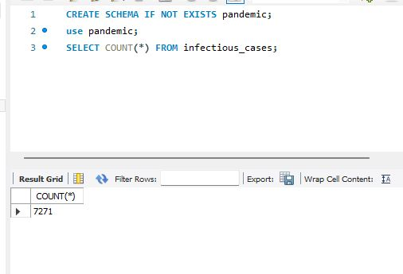
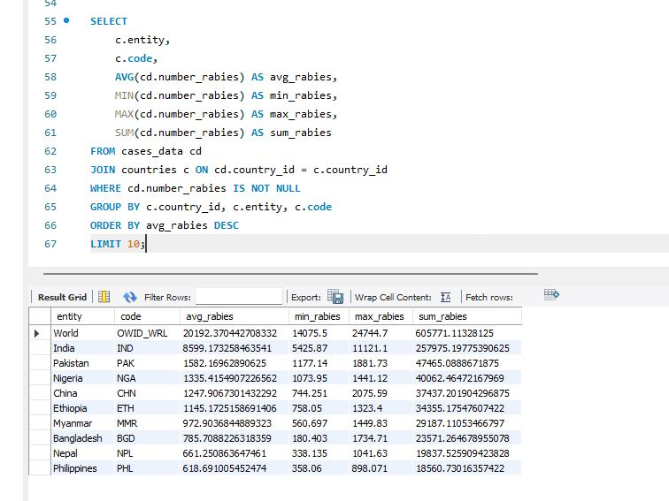
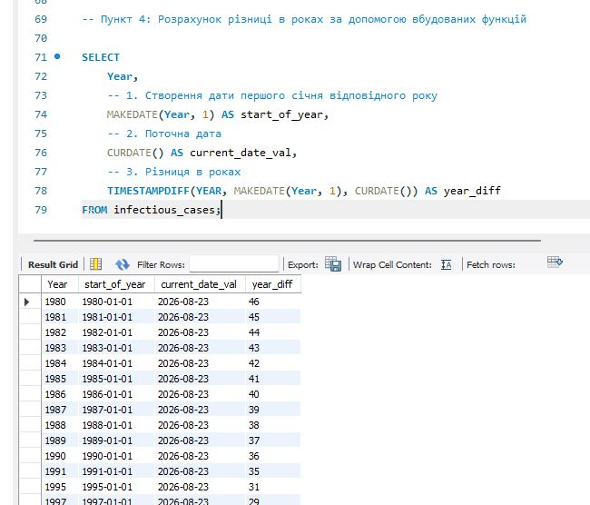
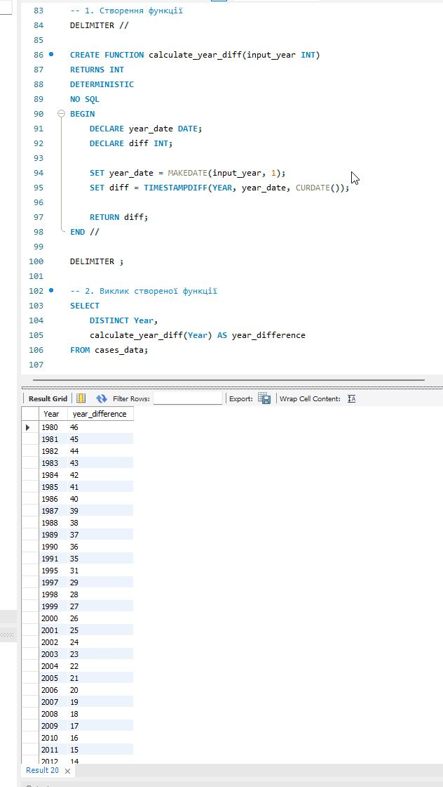
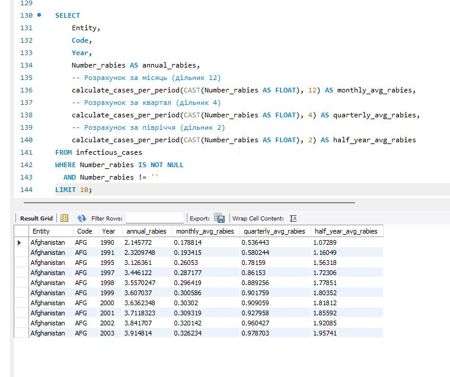
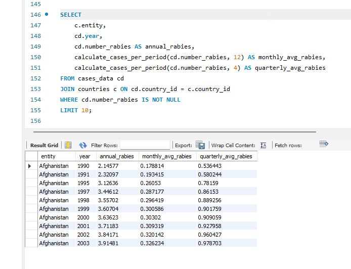

## Task 1
 Завантажте дані:

- Створіть схему pandemic у базі даних за допомогою SQL-команди.
- Оберіть її як схему за замовчуванням за допомогою SQL-команди.
- Імпортуйте дані за допомогою Import wizard так, як ви вже робили це у темі 3.
- Продивіться дані, щоб бути у контексті.

```
CREATE SCHEMA IF NOT EXISTS pandemic;
use pandemic;
SELECT COUNT(*) FROM infectious_cases;
```



## Task 2

Нормалізуйте таблицю infectious_cases до 3ї нормальної форми. 
Збережіть у цій же схемі дві таблиці з нормалізованими даними.

Виконайте запит SELECT COUNT(*) FROM infectious_cases , щоб ментор міг зрозуміти, скільки записів ви завантажили у базу даних із файла.

```

CREATE TABLE countries (
    country_id INT AUTO_INCREMENT PRIMARY KEY,
    entity VARCHAR(255) NOT NULL,
    code VARCHAR(10)
);

INSERT INTO countries (entity, code)
SELECT DISTINCT Entity, Code 
FROM infectious_cases;

CREATE TABLE cases_data (
    case_id INT AUTO_INCREMENT PRIMARY KEY,
    country_id INT,
    year INT,
    number_yaws FLOAT,
    polio_cases INT,
    cases_guinea_worm INT,
    number_rabies FLOAT,
    number_malaria FLOAT,
    number_hiv FLOAT,
    number_tuberculosis FLOAT,
    number_smallpox INT,
    number_cholera_cases INT,
    FOREIGN KEY (country_id) REFERENCES countries(country_id)
);

INSERT INTO cases_data (
    country_id, year, number_yaws, polio_cases, 
    cases_guinea_worm, number_rabies, number_malaria, 
    number_hiv, number_tuberculosis, number_smallpox, number_cholera_cases
)
SELECT 
    c.country_id,
    ic.Year,
    NULLIF(ic.Number_yaws, ''),
    NULLIF(ic.polio_cases, ''),
    NULLIF(ic.cases_guinea_worm, ''),
    NULLIF(ic.Number_rabies, ''),
    NULLIF(ic.Number_malaria, ''),
    NULLIF(ic.Number_hiv, ''),
    NULLIF(ic.Number_tuberculosis, ''),
    NULLIF(ic.Number_smallpox, ''),
    NULLIF(ic.Number_cholera_cases, '')
FROM infectious_cases ic
JOIN countries c ON ic.Entity = c.entity AND (ic.Code = c.code OR (ic.Code IS NULL AND c.code IS NULL));
```

## Task 3

Проаналізуйте дані:

Для кожної унікальної комбінації Entity та Code або їх id порахуйте середнє, мінімальне, максимальне значення та суму для атрибута Number_rabies.

💡 Врахуйте, що атрибут Number_rabies може містити порожні значення ‘’ — вам попередньо необхідно їх відфільтрувати.

Результат відсортуйте за порахованим середнім значенням у порядку спадання.
Оберіть тільки 10 рядків для виведення на екран.

```
-- аналіз даних по сказу 

SELECT 
    c.entity,
    c.code,
    AVG(cd.number_rabies) AS avg_rabies,
    MIN(cd.number_rabies) AS min_rabies,
    MAX(cd.number_rabies) AS max_rabies,
    SUM(cd.number_rabies) AS sum_rabies
FROM cases_data cd
JOIN countries c ON cd.country_id = c.country_id
WHERE cd.number_rabies IS NOT NULL
GROUP BY c.country_id, c.entity, c.code
ORDER BY avg_rabies DESC
LIMIT 10;
```



## Task 4

Побудуйте колонку різниці в роках.

Для оригінальної або нормованої таблиці для колонки Year побудуйте з використанням вбудованих SQL-функцій:
атрибут, що створює дату першого січня відповідного року,

💡 Наприклад, якщо атрибут містить значення ’1996’, то значення нового атрибута має бути ‘1996-01-01’.

атрибут, що дорівнює поточній даті,

атрибут, що дорівнює різниці в роках двох вищезгаданих колонок.

💡 Перераховувати всі інші атрибути, такі як Number_malaria, не потрібно.

```
SELECT 
    Year,
    -- 1. Створення дати першого січня відповідного року
    MAKEDATE(Year, 1) AS start_of_year,
    -- 2. Поточна дата
    CURDATE() AS current_date_val,
    -- 3. Різниця в роках
    TIMESTAMPDIFF(YEAR, MAKEDATE(Year, 1), CURDATE()) AS year_diff
FROM infectious_cases;
```




## Task 5 

Побудуйте власну функцію.

Створіть і використайте функцію, що будує такий же атрибут, як і в попередньому завданні: функція має приймати на вхід значення року, а повертати різницю в роках між поточною датою та датою, створеною з атрибута року (1996 рік → ‘1996-01-01’).

```
-- 1. Створення функції

DELIMITER //

CREATE FUNCTION calculate_year_diff(input_year INT)
RETURNS INT
DETERMINISTIC
NO SQL
BEGIN
    DECLARE year_date DATE;
    DECLARE diff INT;
    
    SET year_date = MAKEDATE(input_year, 1);
    SET diff = TIMESTAMPDIFF(YEAR, year_date, CURDATE());
    
    RETURN diff;
END //

DELIMITER ;

-- 2. Виклик створеної функції
SELECT 
    DISTINCT Year,
    calculate_year_diff(Year) AS year_difference
FROM cases_data;

``` 




## Додаткове завдання

Функція, що рахує кількість захворювань за певний період. Для цього треба поділити кількість захворювань на рік на певне число: 12 — для отримання середньої кількості захворювань на місяць, 4 — на квартал або 2 — на півріччя. Таким чином, функція буде приймати два параметри: кількість захворювань на рік та довільний дільник. Ви також маєте використати її — запустити на даних. Оскільки не всі рядки містять число захворювань, вам необхідно буде відсіяти ті, що не мають чисельного значення (≠ ‘’).

```
DELIMITER //

CREATE FUNCTION calculate_cases_per_period(
    annual_cases FLOAT,
    period_divisor FLOAT
)
RETURNS FLOAT
DETERMINISTIC
NO SQL
BEGIN
    -- Захист від ділення на нуль або некоректного дільника
    IF period_divisor IS NULL OR period_divisor = 0 THEN
        RETURN NULL;
    END IF;

    RETURN annual_cases / period_divisor;
END //

DELIMITER ;

-- з першої версії таблиці

SELECT 
    Entity,
    Code,
    Year,
    Number_rabies AS annual_rabies,
    -- Розрахунок за місяць (дільник 12)
    calculate_cases_per_period(CAST(Number_rabies AS FLOAT), 12) AS monthly_avg_rabies,
    -- Розрахунок за квартал (дільник 4)
    calculate_cases_per_period(CAST(Number_rabies AS FLOAT), 4) AS quarterly_avg_rabies,
    -- Розрахунок за півріччя (дільник 2)
    calculate_cases_per_period(CAST(Number_rabies AS FLOAT), 2) AS half_year_avg_rabies
FROM infectious_cases
WHERE Number_rabies IS NOT NULL 
  AND Number_rabies != ''
LIMIT 10;

```



```
-- з нормалізованої БД, таблиця cases_data
SELECT 
    c.entity,
    cd.year,
    cd.number_rabies AS annual_rabies,
    calculate_cases_per_period(cd.number_rabies, 12) AS monthly_avg_rabies,
    calculate_cases_per_period(cd.number_rabies, 4) AS quarterly_avg_rabies
FROM cases_data cd
JOIN countries c ON cd.country_id = c.country_id
WHERE cd.number_rabies IS NOT NULL
LIMIT 10;

```


