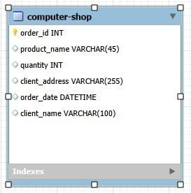
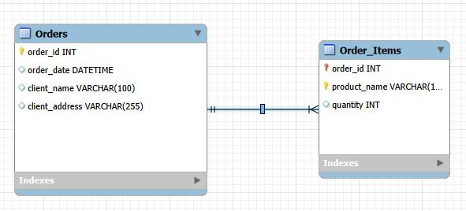
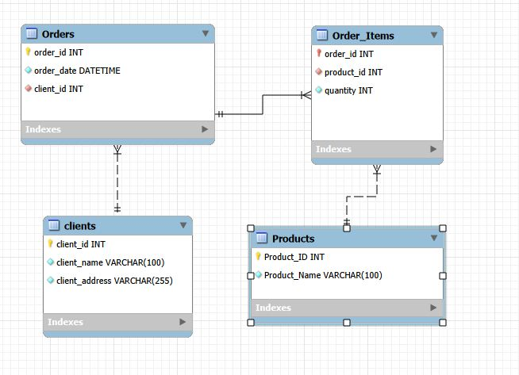
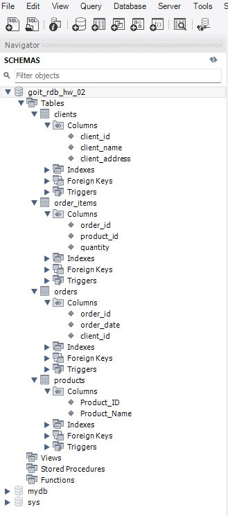
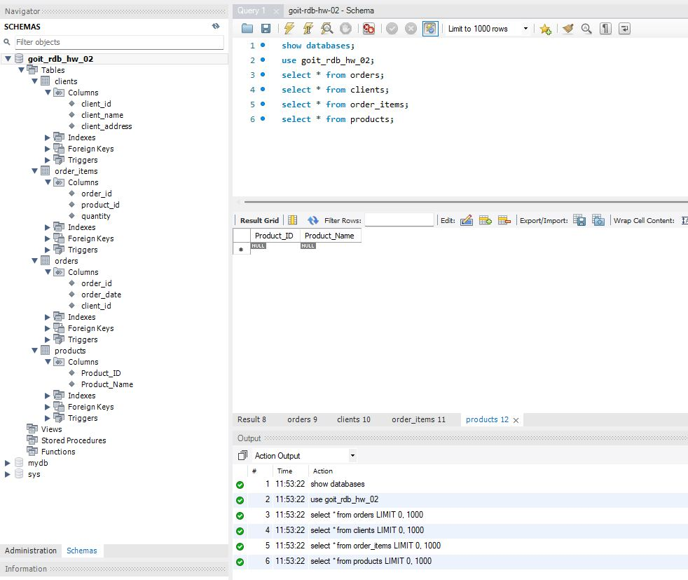

## Перша нормальна форма (1NF)
**Вимога 1NF**: Усі атрибути повинні бути атомарними (неділимими), а кожен рядок — унікальним.

**Що виправлено**:
Початкове поле «Назва_товару і кількість» містило неатомарні значення (списки товарів у межах однієї комірки). Ми розбиваємо його на два окремі атрибути: product_name та quantity, створюючи окремий рядок для кожного товару в замовленні.

## Друга нормальна форма (2NF)
**Вимога 2NF**: Таблиця перебуває в 1NF, і всі неключові атрибути повністю залежать від усього первинного ключа (відсутні часткові залежності).
**Аналіз залежностей**:
- (order_id, product_name) $\rightarrow$ quantity (Повна залежність: кількість стосується конкретного товару у конкретному замовленні)
- order_id $\rightarrow$ order_date, client_name, client_address (Часткова залежність: дата та дані клієнта залежать лише від order_id, а не від назви товару).

## Третя нормальна форма (3NF)

**Вимога 3NF**: Таблиці перебувають у 2NF, і відсутні транзитивні залежності (неключові атрибути не залежать від інших неключових атрибутів).

**Аналіз залежностей у 2NF**:

- У таблиці Orders: client_name $\rightarrow$ client_address (Адреса належить клієнту, а не безпосередньо замовленню).
- У таблиці Order_Items: використання текстової назви product_name як частини ключа створює дублювання даних.

Створюємо окремі сутності для Клієнтів та Товарів із власними ідентифікаторами (client_id, product_id).

## Кардинальності та відношення між сутностями

**Clients $\rightarrow$ Orders (1 : N)**:
- Один клієнт може зробити кілька замовлень ($0..N$).
- Кожне замовлення належить ровно одному клієнту ($1$).

**Orders $\rightarrow$ Order_Items (1 : N)**:
- Одне замовлення містить одну або більше позицій ($1..N$).
- Кожен рядок у Order_Items належить єдиному замовленню ($1$).

**Products $\rightarrow$ Order_Items (1 : N)**:
- Один товар може фігурувати в багатьох замовленнях ($0..N$).

**Примітка**: 
- Відношення між Orders та Products — M : N (Багато-до-Багатьох), яке розв'язується через сполучну таблицю Order_Items.

## Результат 

ER-діаграма

Перетворення в базу даних з таблицями

