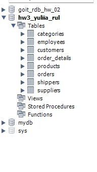
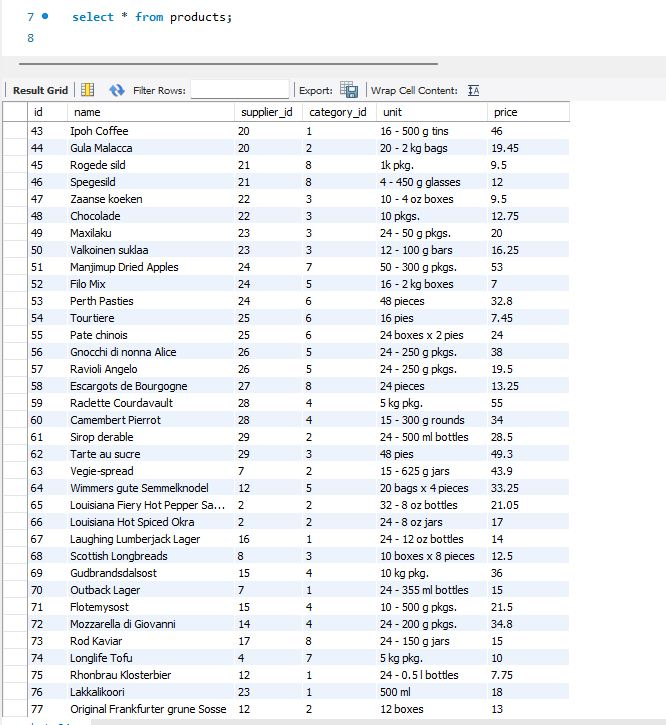
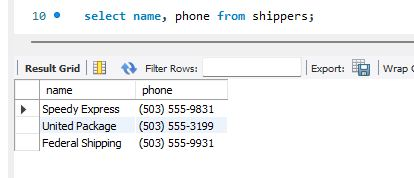
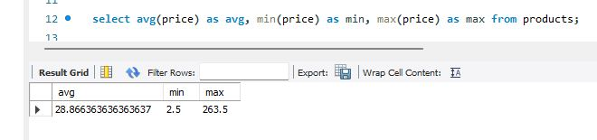
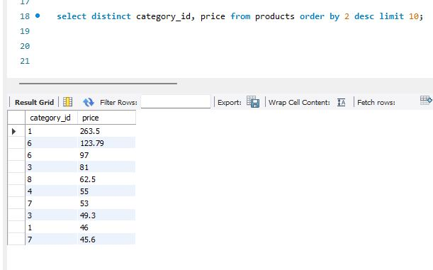
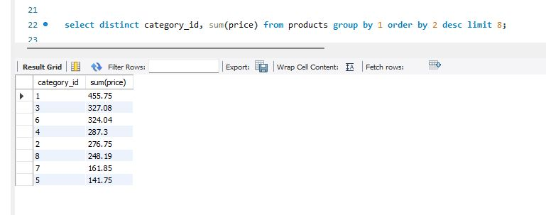
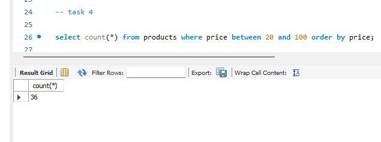
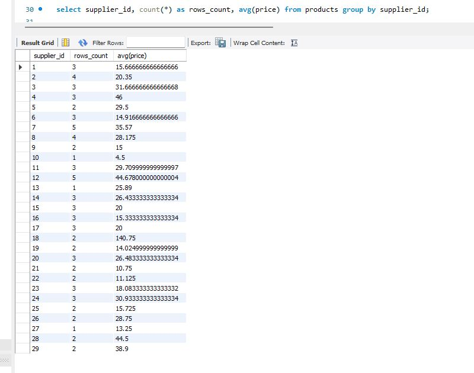

## Task 1
Напишіть SQL команду, за допомогою якої можна:
вибрати всі стовпчики (За допомогою wildcard “*”) з таблиці products;
вибрати тільки стовпчики name, phone з таблиці shippers,
та перевірте правильність її виконання в MySQL Workbench.

```sql:
select * from products;
select name, phone from shippers;
```






## Task 2

Напишіть SQL команду, за допомогою якої можна знайти середнє, максимальне та мінімальне значення стовпчика price таблички products, та перевірте правильність її виконання в MySQL Workbench*.*

```sql:
select avg(price) as avg, min(price) as min, max(price) as max from products;
```



## Task 3

Напишіть SQL команду, за допомогою якої можна обрати унікальні значення колонок category_id та price таблиці products.Оберіть порядок виведення на екран за спаданням значення price та виберіть тільки 10 рядків. Перевірте правильність виконання команди в MySQL Workbench.

```sql:
select distinct category_id, priсe from products order by 2 desc limit 10;
```

-- більш логічний та гарніший варіант:

```sql:
select distinct category_id, sum(price) from products group by 1 order by 2 desc limit 8;
```





## Task 4

Напишіть SQL команду, за допомогою якої можна знайти кількість продуктів (рядків), які знаходиться в цінових межах від 20 до 100, та перевірте правильність її виконання в MySQL Workbench.

```sql:
select count(*) from products where price between 20 and 100 order by price;
```



## Task 5

Напишіть SQL команду, за допомогою якої можна знайти кількість продуктів (рядків) та середню ціну (price) у кожного постачальника (supplier_id), та перевірте правильність її виконання в MySQL Workbench.

```sql:
select supplier_id, count(*) as rows_count, avg(price) from products group by supplier_id;
```

