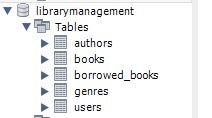
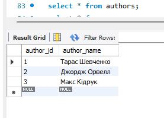
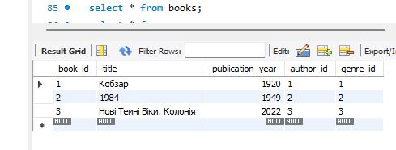
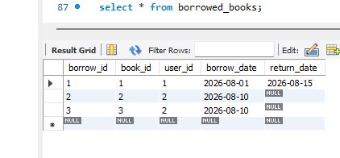
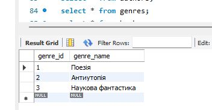
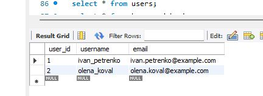
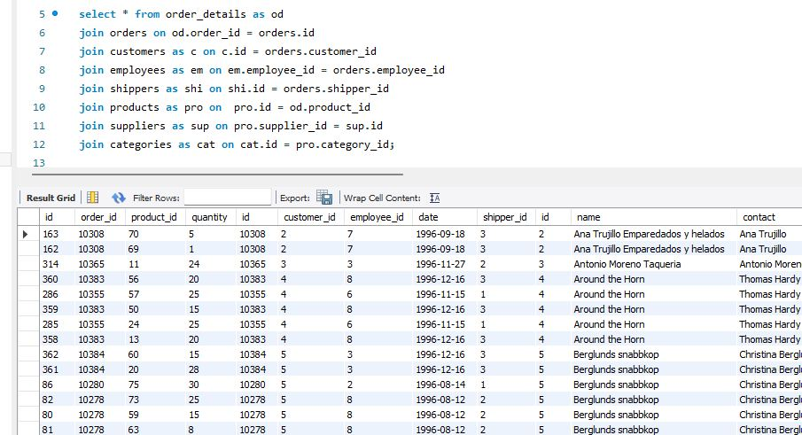
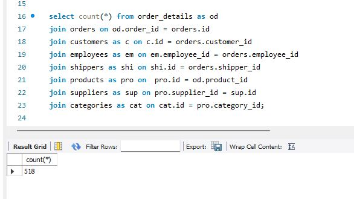
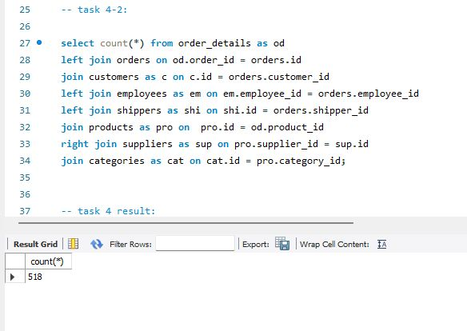
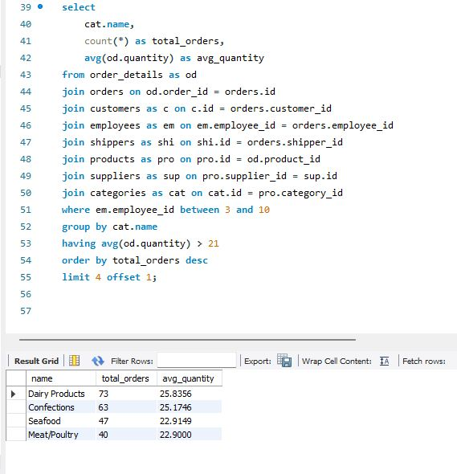

## Task 1 

Створіть базу даних для керування бібліотекою книг згідно зі структурою, наведеною нижче. Використовуйте DDL-команди для створення необхідних таблиць та їх зв'язків.

Структура БД

a) Назва схеми — “LibraryManagement”

b) Таблиця "authors":

author_id (INT, автоматично зростаючий PRIMARY KEY)

author_name (VARCHAR)

c) Таблиця "genres":

genre_id (INT, автоматично зростаючий PRIMARY KEY)

genre_name (VARCHAR)

d) Таблиця "books":
book_id (INT, автоматично зростаючий PRIMARY KEY)

title (VARCHAR)

publication_year (YEAR)

author_id (INT, FOREIGN KEY зв'язок з "Authors")

genre_id (INT, FOREIGN KEY зв'язок з "Genres")

e) Таблиця "users":

user_id (INT, автоматично зростаючий PRIMARY KEY)

username (VARCHAR)

email (VARCHAR)

f) Таблиця "borrowed_books":

borrow_id (INT, автоматично зростаючий PRIMARY KEY)

book_id (INT, FOREIGN KEY зв'язок з "Books")

user_id (INT, FOREIGN KEY зв'язок з "Users")

borrow_date (DATE)

return_date (DATE)

### result

```
-- 1. Створення та вибір схеми (бази даних)
CREATE SCHEMA IF NOT EXISTS LibraryManagement;
USE LibraryManagement;

-- 2. Таблиця авторів
CREATE TABLE IF NOT EXISTS authors (
    author_id INT AUTO_INCREMENT PRIMARY KEY,
    author_name VARCHAR(255) NOT NULL
);

-- 3. Таблиця жанрів
CREATE TABLE IF NOT EXISTS genres (
    genre_id INT AUTO_INCREMENT PRIMARY KEY,
    genre_name VARCHAR(100) NOT NULL
);

-- 4. Таблиця книг
CREATE TABLE IF NOT EXISTS books (
    book_id INT AUTO_INCREMENT PRIMARY KEY,
    title VARCHAR(255) NOT NULL,
    publication_year YEAR,
    author_id INT NOT NULL,
    genre_id INT NOT NULL,
    FOREIGN KEY (author_id) REFERENCES authors(author_id),
    FOREIGN KEY (genre_id) REFERENCES genres(genre_id)
);

-- 5. Таблиця користувачів
CREATE TABLE IF NOT EXISTS users (
    user_id INT AUTO_INCREMENT PRIMARY KEY,
    username VARCHAR(100) NOT NULL,
    email VARCHAR(255) NOT NULL UNIQUE
);

-- 6. Таблиця виданих книг
CREATE TABLE IF NOT EXISTS borrowed_books (
    borrow_id INT AUTO_INCREMENT PRIMARY KEY,
    book_id INT NOT NULL,
    user_id INT NOT NULL,
    borrow_date DATE NOT NULL,
    return_date DATE,
    FOREIGN KEY (book_id) REFERENCES books(book_id),
    FOREIGN KEY (user_id) REFERENCES users(user_id) 
);
```



## Task 2

Заповніть таблиці простими видуманими тестовими даними. Достатньо одного-двох рядків у кожну таблицю.

```
USE LibraryManagement;

-- Додавання авторів
INSERT INTO authors (author_name) 
VALUES 
    ('Тарас Шевченко'),
    ('Джордж Орвелл'),
    ('Макс Кідрук');
    
-- Додавання жанрів
INSERT INTO genres (genre_name) 
VALUES 
    ('Поезія'),
    ('Антиутопія'),
    ('Hаукова фантастика');

-- Додавання книг
INSERT INTO books (title, publication_year, author_id, genre_id) 
VALUES 
    ('Кобзар', 1920, 1, 1),
    ('1984', 1949, 2, 2),
    ('Нові Темні Віки. Колонія', 2022, 3, 3);

-- Додавання користувачів
INSERT INTO users (username, email) 
VALUES 
    ('ivan_petrenko', 'ivan.petrenko@example.com'),
    ('olena_koval', 'olena.koval@example.com');

-- Додавання записів про взяті книги
INSERT INTO borrowed_books (book_id, user_id, borrow_date, return_date) 
VALUES 
    (1, 1, '2026-08-01', '2026-08-15'),
    (2, 2, '2026-08-10', NULL),
    (3, 2, '2026-08-10', NULL);
```









## Task 3

Перейдіть до бази даних, з якою працювали у темі 3. Напишіть запит за допомогою операторів FROM та INNER JOIN, що об’єднує всі таблиці даних, які ми завантажили з файлів: order_details, orders, customers, products, categories, employees, shippers, suppliers. Для цього ви маєте знайти спільні ключі.

Перевірте правильність виконання запиту.

```
select * from order_details as od
join orders on od.order_id = orders.id
join customers as c on c.id = orders.customer_id
join employees as em on em.employee_id = orders.employee_id
join shippers as shi on shi.id = orders.shipper_id
join products as pro on  pro.id = od.product_id
join suppliers as sup on pro.supplier_id = sup.id
join categories as cat on cat.id = pro.category_id;
```



## Task 4 

- Визначте, скільки рядків ви отримали (за допомогою оператора COUNT).

```
select count(*) from order_details as od
join orders on od.order_id = orders.id
join customers as c on c.id = orders.customer_id
join employees as em on em.employee_id = orders.employee_id
join shippers as shi on shi.id = orders.shipper_id
join products as pro on  pro.id = od.product_id
join suppliers as sup on pro.supplier_id = sup.id
join categories as cat on cat.id = pro.category_id;
```



- Змініть декілька операторів INNER на LEFT чи RIGHT. Визначте, що відбувається з кількістю рядків. Чому? Напишіть відповідь у текстовому файлі.

```
select count(*) from order_details as od
left join orders on od.order_id = orders.id
join customers as c on c.id = orders.customer_id
left join employees as em on em.employee_id = orders.employee_id
left join shippers as shi on shi.id = orders.shipper_id
join products as pro on  pro.id = od.product_id
right join suppliers as sup on pro.supplier_id = sup.id
join categories as cat on cat.id = pro.category_id;
```




### пояснення

Наступні INNER JOIN анулюють дію LEFT та RIGHT JOIN
У SQL джойни обчислюються послідовно. Якщо ви робите LEFT JOIN, рядок без пари заповнюється значеннями NULL. Але якщо далі за ланцюжком стоїть звичайний JOIN (INNER JOIN), який перевіряє колонку з цієї таблиці, він викидає всі згенеровані NULL.

LEFT JOIN orders ➔ JOIN customers:

Якби для деталі замовлення не знайшлося запису в orders, поле orders.customer_id стало б NULL. Наступний JOIN customers ON c.id = orders.customer_id відсікає такий рядок, бо c.id = NULL повертає UNKNOWN.

LEFT JOIN employees ➔ JOIN products:

Якщо працівник не знайдений, em.employee_id стає NULL. Наступний JOIN products ON pro.id = em.employee_id відсікає ці порожні рядки.

RIGHT JOIN suppliers ➔ JOIN categories:

RIGHT JOIN бере всіх постачальників, навіть тих, у яких немає прив'язаних товарів. Для таких "зайвих" постачальників усі колонки ліворуч (pro.*, od.*, orders.*) заповнюються NULL. Але одразу після цього йде JOIN categories ON cat.id = pro.category_id. Оскільки pro.category_id є NULL, цей INNER JOIN одразу викидає всі додаткові рядки, повернуті RIGHT JOIN.


---

* На основі запита з пункта 3 виконайте наступне: оберіть тільки ті рядки, де employee_id > 3 та ≤ 10.
* Згрупуйте за іменем категорії, порахуйте кількість рядків у групі, середню кількість товару (кількість товару знаходиться в order_details.quantity)
* Відфільтруйте рядки, де середня кількість товару більша за 21.
* Відсортуйте рядки за спаданням кількості рядків.
* Виведіть на екран (оберіть) чотири рядки з пропущеним першим рядком.

```
select 
    cat.name,
    count(*) as total_orders, 
    avg(od.quantity) as avg_quantity
from order_details as od
join orders on od.order_id = orders.id
join customers as c on c.id = orders.customer_id
join employees as em on em.employee_id = orders.employee_id
join shippers as shi on shi.id = orders.shipper_id
join products as pro on pro.id = od.product_id
join suppliers as sup on pro.supplier_id = sup.id
join categories as cat on cat.id = pro.category_id
where em.employee_id between 3 and 10
group by cat.name
having avg(od.quantity) > 21
order by total_orders desc
limit 4 offset 1;
```

