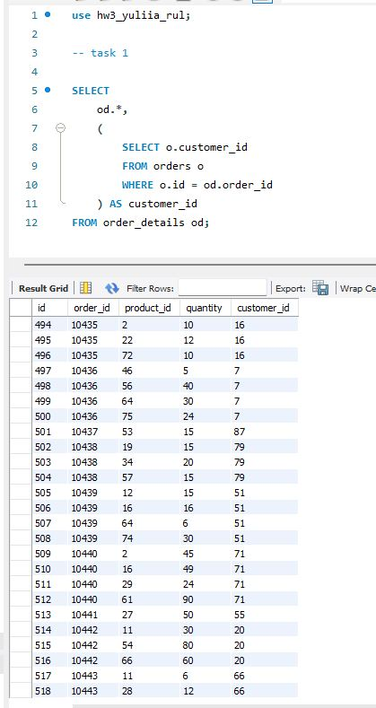
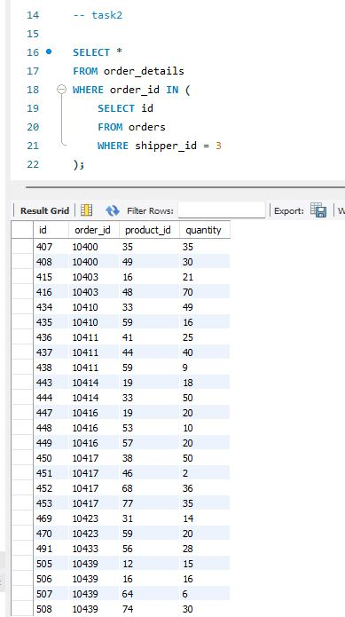
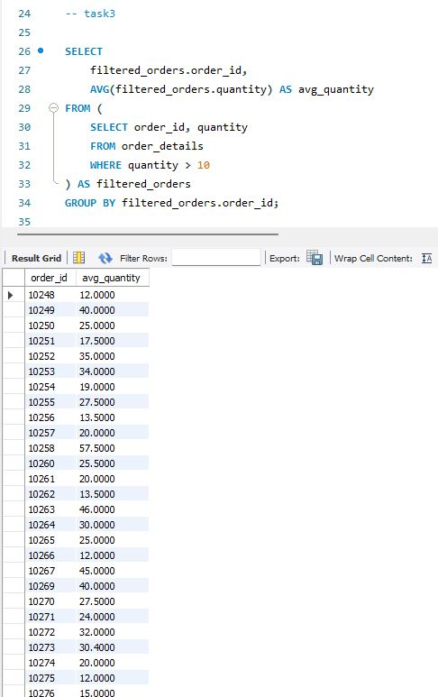
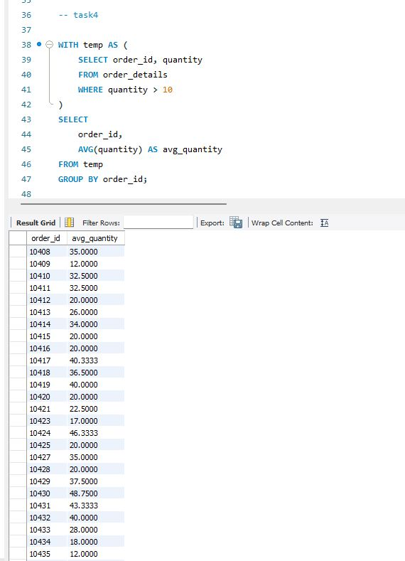
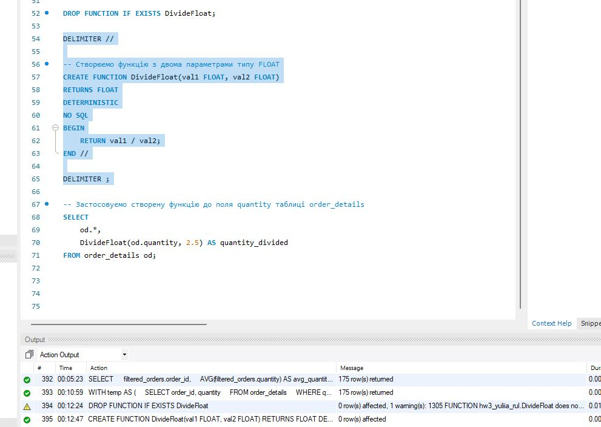
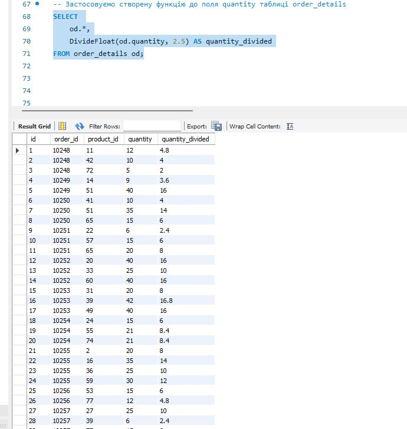

# Home Work 5 

## Скрипт 1

Напишіть SQL запит, який буде відображати таблицю order_details та поле customer_id з таблиці orders відповідно для кожного поля запису з таблиці order_details.

Це має бути зроблено за допомогою вкладеного запиту в операторі SELECT.

```
SELECT 
    od.*,
    (
        SELECT o.customer_id 
        FROM orders o 
        WHERE o.id = od.order_id
    ) AS customer_id
FROM order_details od;
```



## Скрипт 2

Напишіть SQL запит, який буде відображати таблицю order_details. Відфільтруйте результати так, щоб відповідний запис із таблиці orders виконував умову shipper_id=3.

Це має бути зроблено за допомогою вкладеного запиту в операторі WHERE.

```
SELECT *
FROM order_details
WHERE order_id IN (
    SELECT id 
    FROM orders 
    WHERE shipper_id = 3
);
```



## Скрипт 3

Напишіть SQL запит, вкладений в операторі FROM, який буде обирати рядки з умовою quantity>10 з таблиці order_details. Для отриманих даних знайдіть середнє значення поля quantity — групувати слід за order_id.

```
SELECT 
    filtered_orders.order_id,
    AVG(filtered_orders.quantity) AS avg_quantity
FROM (
    SELECT order_id, quantity
    FROM order_details
    WHERE quantity > 10
) AS filtered_orders
GROUP BY filtered_orders.order_id;
```



## Скрипт 4

Розв’яжіть завдання 3, використовуючи оператор WITH для створення тимчасової таблиці temp. Якщо ваша версія MySQL більш рання, ніж 8.0, створіть цей запит за аналогією до того, як це зроблено в конспекті.

```
WITH temp AS (
    SELECT order_id, quantity
    FROM order_details
    WHERE quantity > 10
)
SELECT 
    order_id,
    AVG(quantity) AS avg_quantity
FROM temp
GROUP BY order_id;
```



## Скрипт 5

Створіть функцію з двома параметрами, яка буде ділити перший параметр на другий. Обидва параметри та значення, що повертається, повинні мати тип FLOAT.

Використайте конструкцію DROP FUNCTION IF EXISTS. Застосуйте функцію до атрибута quantity таблиці order_details . Другим параметром може бути довільне число на ваш розсуд.

```
-- Видаляємо функцію, якщо вона вже існує
DROP FUNCTION IF EXISTS DivideFloat;

DELIMITER //

-- Створюємо функцію з двома параметрами типу FLOAT
CREATE FUNCTION DivideFloat(val1 FLOAT, val2 FLOAT)
RETURNS FLOAT
DETERMINISTIC
NO SQL
BEGIN
    RETURN val1 / val2;
END //

DELIMITER ;

-- Застосовуємо створену функцію до поля quantity таблиці order_details
SELECT 
    od.*,
    DivideFloat(od.quantity, 2.5) AS quantity_divided
FROM order_details od;
```



