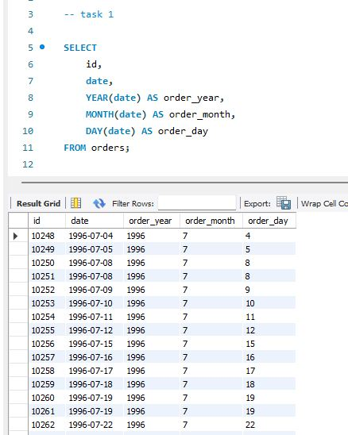
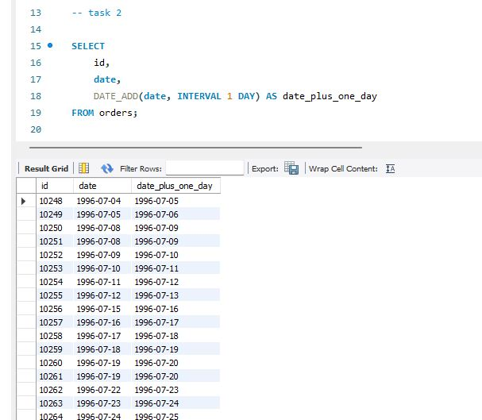
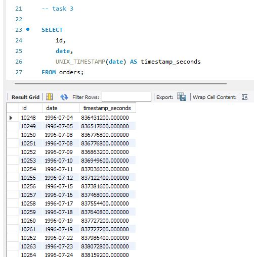
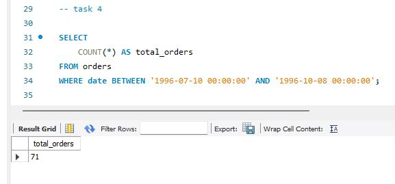
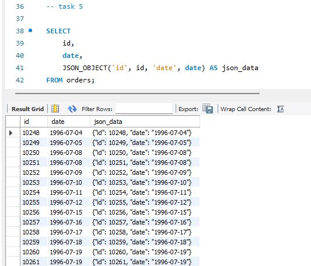

# Home Work 7

## Скрипт 1

Напишіть SQL-запит, який для таблиці orders з атрибута date витягує рік, місяць і число. Виведіть на екран їх у три окремі атрибути поряд з атрибутом id та оригінальним атрибутом date (всього вийде 5 атрибутів).

```
SELECT 
    id,
    date,
    YEAR(date) AS order_year,
    MONTH(date) AS order_month,
    DAY(date) AS order_day
FROM orders;
```



## Скрипт 2

Напишіть SQL-запит, який для таблиці orders до атрибута date додає один день. На екран виведіть атрибут id, оригінальний атрибут date та результат додавання.

```
SELECT 
    id,
    date,
    DATE_ADD(date, INTERVAL 1 DAY) AS date_plus_one_day
FROM orders;
```



## Скрипт 3

Напишіть SQL-запит, який для таблиці orders для атрибута date відображає кількість секунд з початку відліку (показує його значення timestamp). Для цього потрібно знайти та застосувати необхідну функцію. На екран виведіть атрибут id, оригінальний атрибут date та результат роботи функції.

```
SELECT 
    id,
    date,
    UNIX_TIMESTAMP(date) AS timestamp_seconds
FROM orders;
```



## Скрипт 4

Напишіть SQL-запит, який рахує, скільки таблиця orders містить рядків з атрибутом date у межах між 1996-07-10 00:00:00 та 1996-10-08 00:00:00.

```
SELECT 
    COUNT(*) AS total_orders
FROM orders
WHERE date BETWEEN '1996-07-10 00:00:00' AND '1996-10-08 00:00:00';
```



## Скрипт 5

Напишіть SQL-запит, який для таблиці orders виводить на екран атрибут id, атрибут date та JSON-об’єкт {"id": <атрибут id рядка>, "date": <атрибут date рядка>}. Для створення JSON-об’єкта використайте функцію.

```
SELECT 
    id,
    date,
    JSON_OBJECT('id', id, 'date', date) AS json_data
FROM orders;
```

